# 확인결과 — Playwright 실제 조작 테스트

2026-09-14, Playwright로 브라우저를 직접 띄워서 로그인·클릭·입력을 실제로 수행하며 16개 항목을 테스트했습니다. 모두 화면 캡처로 증거를 남겼습니다.

## 결과 요약

**16개 항목 전부 통과. 발견된 오류는 없습니다.**

## 1. 진입점 리다이렉트

서버 루트(`/`)로 접속하면 자동으로 로그인 화면(`training_index.html`)으로 이동합니다. **통과**

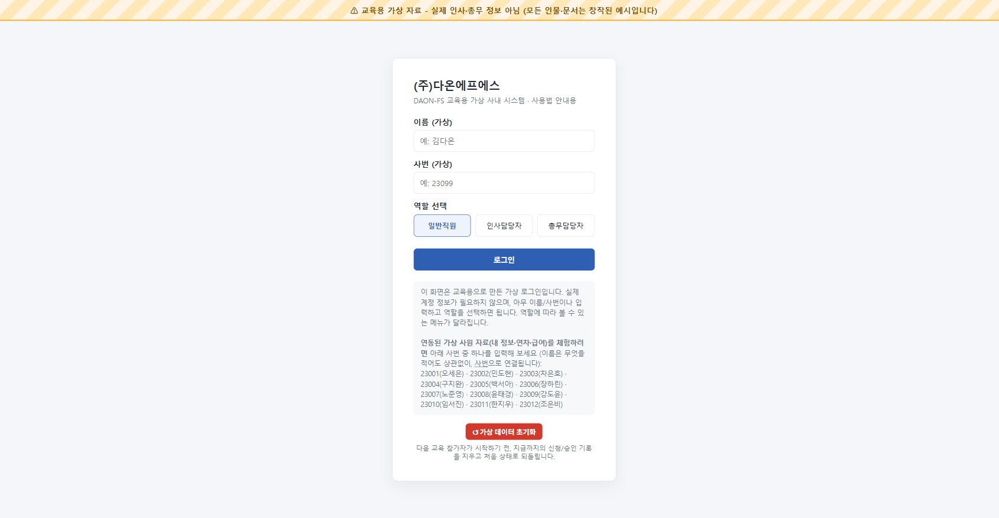

## 2. 로그인 화면

상단 경고 배너, 사번 안내 목록, 가상 데이터 초기화 버튼이 모두 정상적으로 보입니다. **통과**

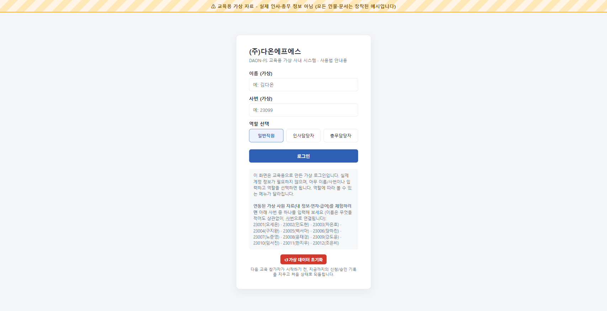

## 3. 일반직원 로그인 → 대시보드

사번 23003(차은호)으로 일반직원 로그인. 대시보드에 "휴가 승인 처리"·"사원 목록"·"비품 승인 처리" 메뉴가 보이지 않습니다. **통과**

## 4. 내 정보 조회 (실데이터 연결)

차은호의 실제 연동 데이터(영업1팀·대리·기본급 3,300,000원·실지급액 3,105,000원)가 정확히 표시됩니다. **통과**

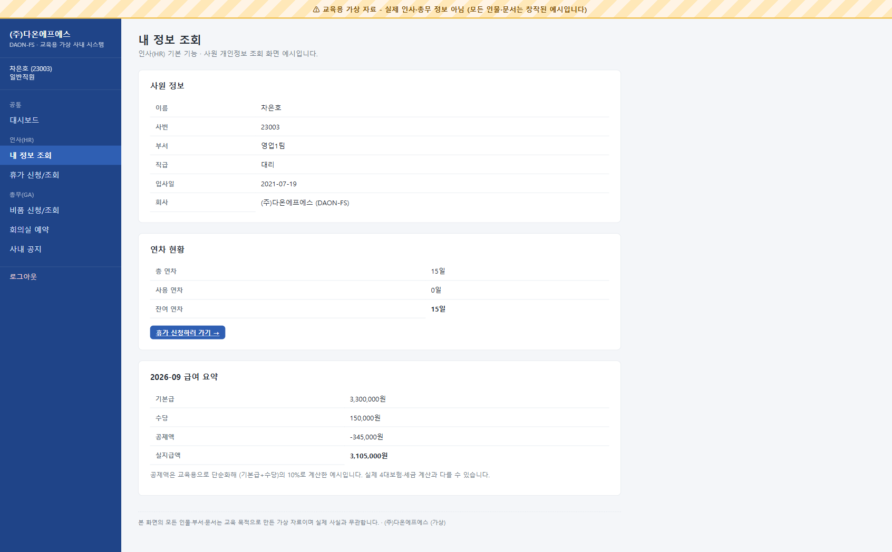

## 5. 휴가 신청

새 휴가를 신청하면 "대기" 상태로 즉시 목록에 나타납니다. **통과**

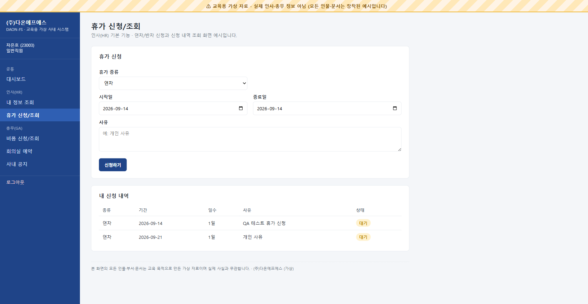

## 6. 비품 신청

새 비품(키보드)을 신청하면 "대기" 상태로 즉시 목록에 나타납니다. **통과**

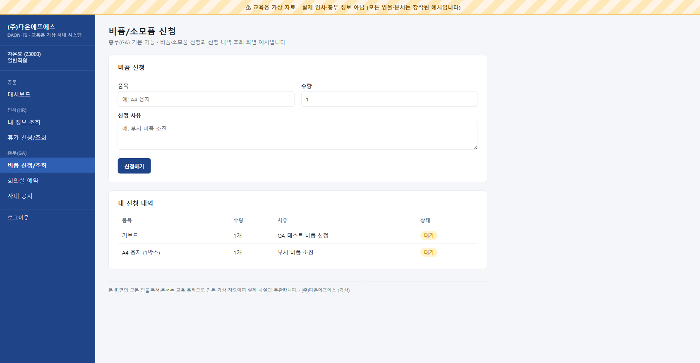

## 7. 회의실 예약 (+ 중복 예약 체크)

기존 예약과 같은 회의실·날짜·시간대로 예약을 시도하면 "이미 예약이 있습니다" 경고가 뜨고 저장되지 않습니다. 다른 시간대로 다시 예약하면 정상적으로 "전체 예약 현황"에 추가됩니다. **통과** (경고창은 브라우저 네이티브 대화상자라 캡처 이미지에는 안 남지만, 예약이 추가되지 않은 것으로 확인)

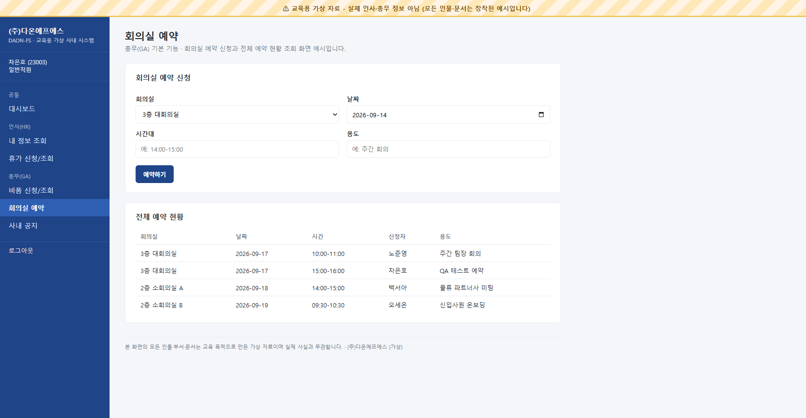

## 8. 사내 공지 — 일반직원

일반직원 화면에는 공지 작성 폼이 보이지 않고 목록만 보입니다. **통과**

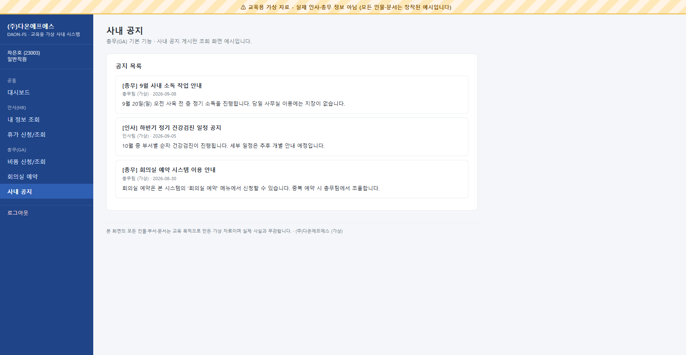

## 9. 권한 없는 페이지 접근 차단

일반직원 계정으로 `training_hr_leave_approve.html`(인사담당자 전용)에 URL로 직접 접근하면 안내 후 대시보드로 자동 이동합니다. **통과**

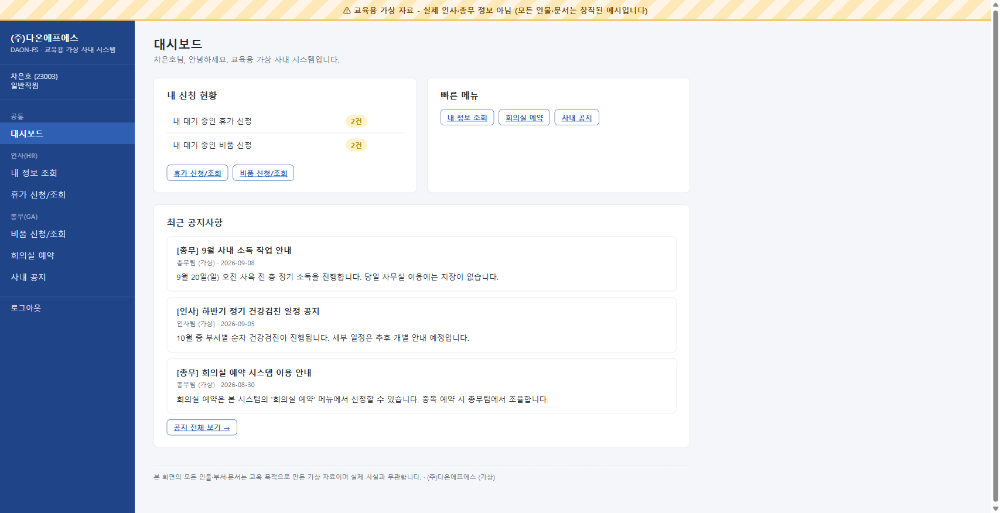

## 10. 휴가 승인 처리 (인사담당자)

사번 23001(오세은)로 인사담당자 로그인 → 5번에서 신청한 건을 승인 처리하면 상태가 즉시 "승인"으로 바뀌고 처리 버튼이 사라집니다. **통과**

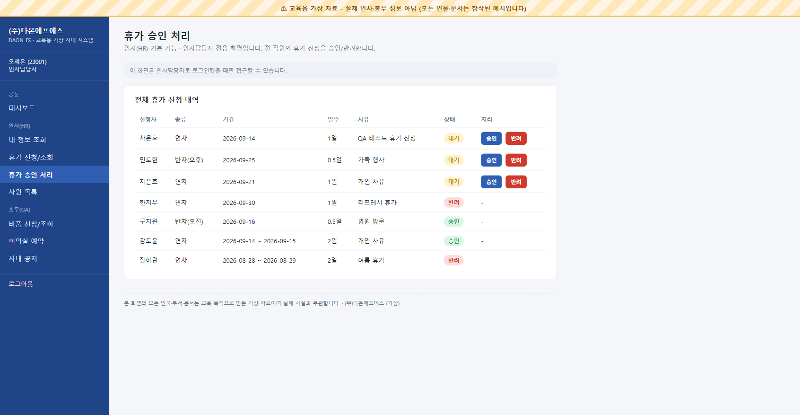
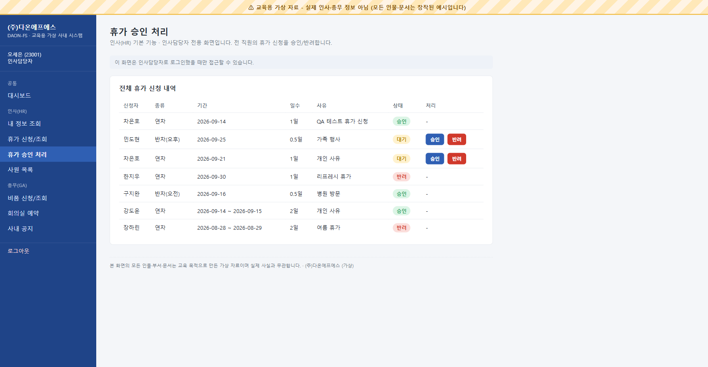

## 11. 사원 목록

인사담당자 화면에서 가상 사원 12명이 모두 나열됩니다. **통과**

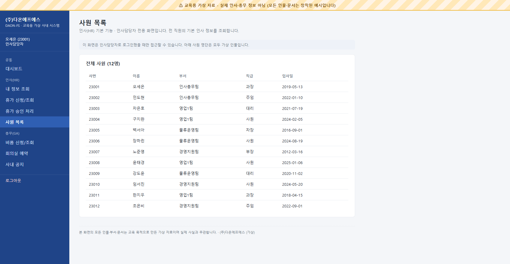

## 12. 비품 승인 처리 (총무담당자)

사번 23012(조은비)로 총무담당자 로그인 → 6번에서 신청한 건을 승인 처리하면 상태가 즉시 "승인"으로 바뀝니다. **통과**

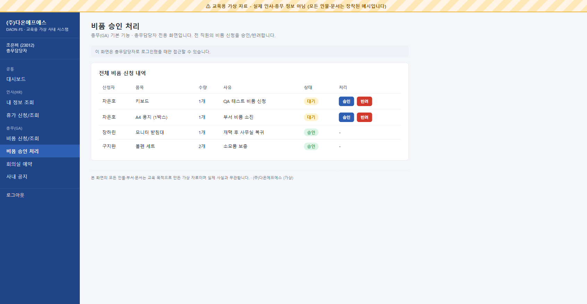
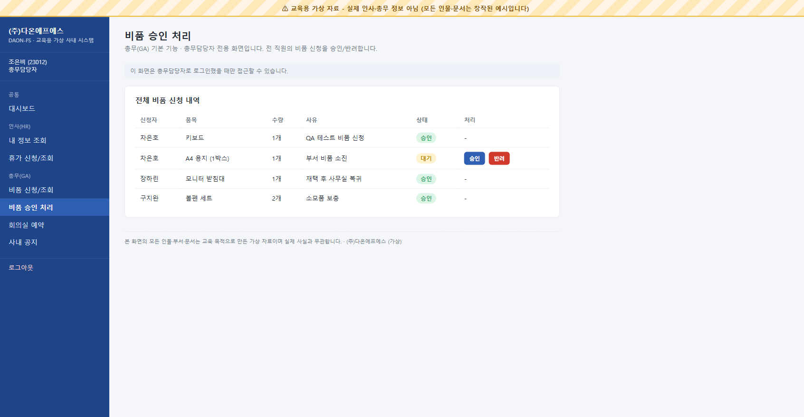

## 13. 사내 공지 — 총무담당자 (작성)

총무담당자 화면에는 공지 작성 폼이 보이고, 실제로 공지를 등록하면 목록에 "조은비 (총무담당자, 가상)" 작성자로 바로 나타납니다. **통과**

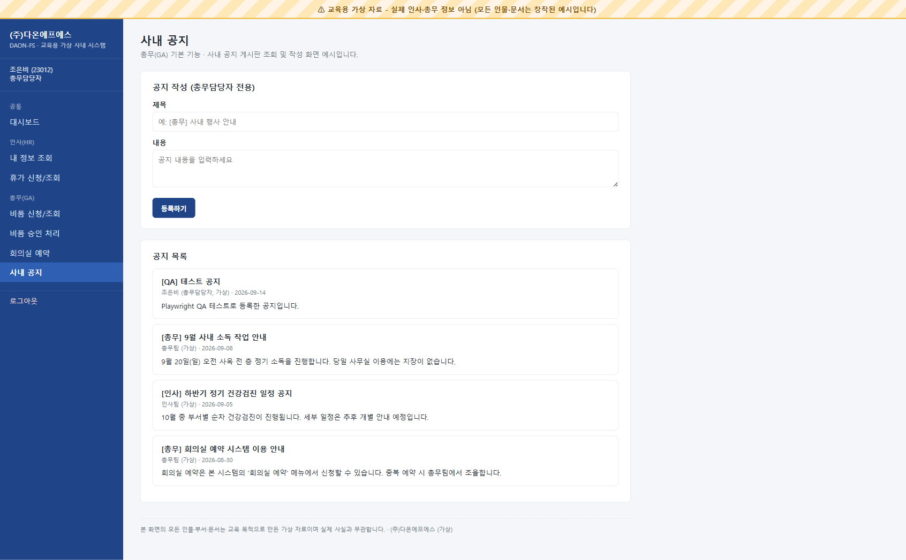

## 14. 이름-사번 연결 방식 확인

일부러 틀린 이름("테스트")과 정확한 사번(23005)으로 로그인해도, 내 정보 조회에 백서아의 실제 데이터(물류운영팀·차장·기본급 4,100,000원)가 그대로 표시됩니다. 이름이 아니라 사번으로 연결된다는 것이 증명됐습니다. **통과**

## 15. 가상 데이터 초기화

로그인 화면에서 "↺ 가상 데이터 초기화" 버튼 클릭 → 확인 → 완료 알림 → 다시 차은호(23003)로 로그인하면, 5·6번에서 추가했던 신청 내역이 모두 사라지고 처음 시드 데이터 상태(대기 1건/1건)로 정확히 돌아갑니다. **통과**

## 16. 워터마크 배너 상시 노출

위 1~15번 캡처 화면 전부에서 "⚠ 교육용 가상 자료 - 실제 인사·총무 정보 아님" 배너가 화면 최상단에 고정되어 보이는 것을 확인했습니다 (로그인, 대시보드, 내 정보, 사원 목록, 승인 화면 등 서로 다른 10개 화면에서 모두 확인). **통과**

## 발견된 오류 및 수정 내역

**발견된 오류 없음.**

테스트 중 브라우저 콘솔 에러는 `favicon.ico` 404 한 건뿐이었고, 이는 앱 동작과 무관한 정상적인 현상입니다(파비콘 파일이 없어서 나는 경고로, 기능에는 영향 없음). 그 외 화면 깨짐, 잘못된 데이터 표시, 권한 오류, 저장 안 되는 문제는 발견되지 않아 코드 수정은 없었습니다.
